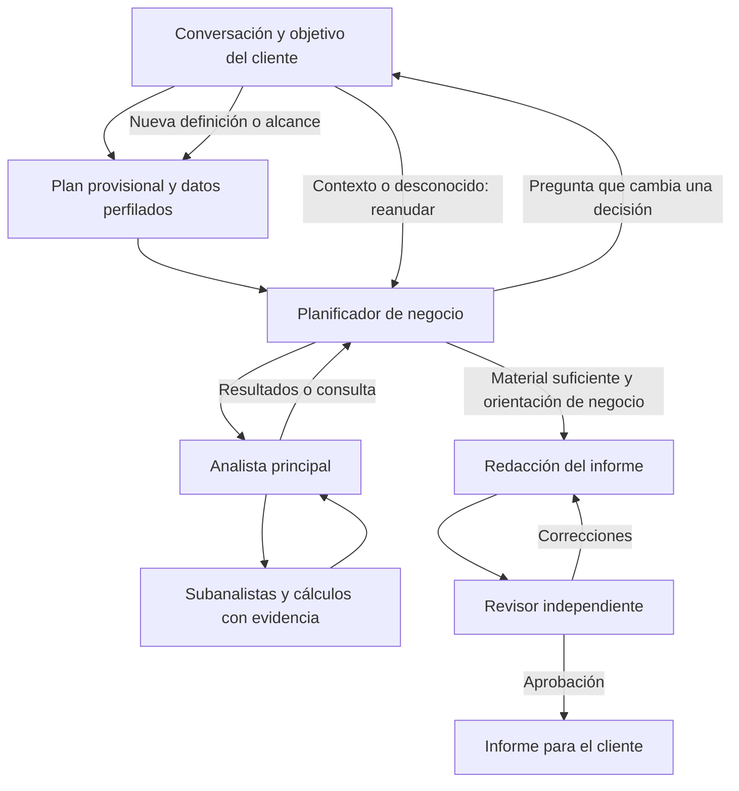

# 3.7 — Planificador de negocio y diálogo durante la investigación

Estado: implementación y evaluación terminadas; aceptación general de calidad abierta. Este documento es
el punto de continuidad tras compactaciones: actualizar progreso y resultados aquí.

## Decisiones y objetivo

El usuario prioriza calidad sobre coste y autoriza preguntas al cliente también
durante el análisis. El conversacional es el único interlocutor visible. El
planificador entiende objetivo/contexto y prioriza; el analista dirige cálculos y
subanalistas; la revisión conserva la aprobación independiente.

La evaluación 3.6 aceptó 4/16 intentos iniciales. Problemas relevantes: cobertura
incompleta, señales sin profundizar, acciones genéricas y agotamiento de revisión.
No atribuir una mejora a más agentes sin comparación independiente.

## Arquitectura que se implementa

1. Conservar el perfilado/plan provisional de tablas existente. Antes de ejecutar
   su agenda, un planificador de negocio especializado lo convierte en un encargo:
   objetivo, decisión buscada, entregables obligatorios, contexto confirmado,
   supuestos, exclusiones, preguntas útiles y prioridades. Se identifica como rol
   y fase propios; no ejecuta Python ni aprueba resultados.
2. Consultarlo al inicio, después de recoger resultados de una tanda de ramas,
   cuando el analista lo solicite y antes de cerrar la investigación. Recibe una
   síntesis respaldada por resultados guardados y el contexto compartido. El
   analista puede abrir desgloses técnicos sin consultarlo por cada cálculo.
3. El planificador da instrucciones concretas para continuar o reconoce suficiencia;
   propone ramas/prioridades, pero el analista las convierte en encargos y valida
   sus dependencias/evidencia. Su visto bueno no sustituye la revisión técnica.
4. Puede formular una pregunta contextual al cliente en esos puntos. Preguntas
   persistentes con motivo, opciones opcionales y referencias a tablas/columnas;
   se presentan en la conversación existente y con datos accesibles. Respuestas
   libres, desconocido y rechazo quedan guardados y no se preguntan repetidamente.
5. Una respuesta contextual se incorpora al diálogo y al contexto de entrega.
   Si cambia definiciones de cálculo o alcance, se crea una planificación sucesora:
   se conservan resultados anteriores, pero no se reutilizan como evidencia vigente.
   La nueva planificación recibe la pregunta y respuesta, también sus límites.
   Un cambio de alcance requiere la respuesta del usuario, no una decisión unilateral.
6. El encargo y las instrucciones llegan al coordinador, sus trabajadores y los dos
   roles de revisión. La revisión contrasta la entrega con el objetivo del usuario,
   no solo con una agenda reducida por los agentes.

## Persistencia y recuperación

- Decisiones del planificador y respuestas en tablas propias, vinculadas a negocio,
  sesión e investigación. Llamadas con fase/versiones/uso en el registro común.
- Claves deterministas por punto de control y respuestas recibidas; guardar antes
  de pausar. Reanudar no repite llamadas completadas ni ramas terminadas.
- Pausa durable mediante el mecanismo de interrupción existente. No cobrar el
  tiempo que el cliente tarda en responder contra el tiempo activo de investigación.
- Las respuestas se capturan con procedencia para memoria; no convertir una
  hipótesis del agente en declaración del propietario.
- Trabajadores no invocan al planificador ni preguntan directamente al usuario.
- Compatibilidad con investigaciones históricas: opciones/versiones guardadas;
  no añadir este circuito retroactivamente a informes ya aprobados.

## Presupuesto orientado a calidad

Nuevo recorrido con márgenes amplios: hasta 12 investigaciones, 8 rondas, 48
programas, 128 llamadas de investigación incluidas las del planificador, 192
acciones y una hora desde el inicio, descontando la espera del cliente. Hasta 24 puntos de consulta al planificador,
incluidas aclaraciones, sin agotar rondas solo por esperar al usuario. Revisión
hasta 8 rondas y 6 programas por rol. Los límites son cortacircuitos recuperables
contra bucles; no criterios para seleccionar hallazgos baratos. Las opciones se
persisten y el uso real se registra, aunque no se imponga un objetivo monetario.
El perfil final permite seis intentos por investigación, hasta 16 llamadas por
trabajador, 512 KB de contexto y cuatro reparaciones de contrato en revisión.
Ninguna ampliación relaja la validación de evidencia ni aprueba por agotamiento.

## Modalidades y alcance

El encargo distingue organizar, descubrir, pregunta concreta, evolución y objetivos
mixtos. Prepara la separación negocio/trabajo necesaria para brainstorming y
predicción, pero este paso no implementa predicciones ni las ofrece como disponibles.
El chat sencillo sigue respondiendo sin disparar todo el circuito de informes.

## Secuencia y comprobaciones

- [x] Contratos, prompts, persistencia y límites del nuevo rol.
- [x] Puntos de diálogo integrados con analista/subanalistas y revisión.
- [x] Preguntas durante investigación, respuestas y recuperación en chat/onboarding.
- [x] Pruebas de aislamiento, replay, desconocido, cambio de definición, cobertura,
      presupuestos amplios, ausencia de recursión y compatibilidad histórica.
- [x] Lote real separado de 3.6 con Bruma y WWI. Comparar planificador activado y
      desactivado con el mismo presupuesto amplio y configuración. Mantener fallos,
      datos originales, evaluaciones y recursos. No adjudicar al planificador una
      mejora debida solo a más presupuesto o seleccionar únicamente el mejor intento.
- [x] Evaluación independiente de las entregas, documentación de resultados,
      revisión de cambios y commit local. No push sin petición.

## Registro de continuidad

- Base de implementación: commit 983438c, rama feature/insights-pipeline.
- Referencia de calidad: docs/validation/2026-09-27-quality-evaluation.md.
- Protocolo existente: docs/technical/quality-evaluation-plan.md.
- No modificar los lotes congelados del 3.6. Artefactos/CSV/credenciales locales
  permanecen fuera de Git. Actualizar este registro antes de una compactación.

### Avance de implementación

Contratos y persistencia implementados en `agent/business_planner.py` y `schema.sql`.
El grafo de investigación v6 consulta al inicio, tras candidatos/tandas, por petición
explícita del principal y antes de cerrar. Las opciones históricas no lo activan.
El recorrido web activa `business_planner` y `quality_first`; las API de investigación
mantienen sus valores históricos por defecto para comparaciones y adaptadores.

Preguntas y respuestas circulan por las rutas existentes de conversación y detalle
del trabajo, con `phase=research` y referencias visibles al dato. El cierre de una
respuesta definicional/de alcance produce `replan_required`; el trabajo web crea
una sesión sucesora y continúa conservando el historial. Las respuestas contextuales
se incluyen en el encargo y la revisión, y en la cola habitual de memoria.

Implementado el ejecutor `evaluation/business_planner_runner.py`: dos modos con
tres trabajadores y presupuesto amplio idéntico, solo cambia la consulta al
planificador. Durante la evaluación no se inventa contexto operativo: una pregunta
nueva recibe «desconocido», manteniendo lo declarado al inicio. Dos repeticiones de
Bruma-descubrir, WWI-organizar y WWI-descubrir: 12 intentos conservados.

Pruebas iniciales: 122 de regresión correctas, más las comprobaciones web específicas
de pregunta/continuidad y replanteamiento. Encontrado y corregido un fallo de
serialización de UUID en respuestas y la desaparición visual de estas respuestas
al pasar a revisión. Son defectos de implementación, no resultados de calidad.
La matriz real se ejecuta desde una copia congelada separada, con montaje Docker
comprobado antes de las llamadas. No alterar esa copia ni sustituir fallos.

Pendiente: revisión independiente de la matriz, controles finales, documentación
con resultados, revisión pública de Git y commit del paso. No declarar mejora antes
de contrastar las entregas completas. El límite implementado de consultas es 24
incluyendo aclaraciones y comprobaciones finales; todo su uso cuenta en las 128
llamadas globales. Aún no se ha cerrado el paso.

### Corrección tras las primeras entregas del lote

Los primeros tres informes aprobados no superaron la evaluación independiente:
uno de control y dos con planificador. El detalle aritmético mejoró, pero persistieron
prioridades basadas solo en volumen y siguientes pasos limitados a verificar registros.
Se conserva el lote completo. Se añade al cierre del planificador un encargo de
redacción obligatorio: prioridad, motivo relativo y comprobación operativa concreta
con su utilidad para decidir. Los criterios compartidos distinguen hipótesis
condicionales útiles de causas inventadas. Se comparará esta corrección en otro lote
congelado; no modificar los informes originales ni atribuir todo cambio al nuevo rol.

Una prueba de WWI también mostró que el límite heredado de tres programas por
investigación impedía una reparación pese al margen global. El perfil de calidad
pasa a seis intentos por investigación (compatibilidad histórica: tres). Una prueba
real de PostgreSQL/Docker hace fallar tres programas en cada una de dos ramas,
recupera ambas en el cuarto y comprueba que reanudar no repite llamadas. La preparación
inicial del lote corregido se sustituyó antes de ejecutar ningún caso; los lotes ya
ejecutados siguen intactos. Se añade una pareja WWI-organizar al lote de corrección.

El intento WWI-organizar que recuperó los cálculos terminó después con un error de
contexto: la suma de evidencia, historial y memoria superó 200 KB. El perfil de
calidad guarda ahora `max_context_bytes=512000` y lo respeta tanto en investigación
como en revisión y al añadir memoria compartida. Las opciones históricas conservan
200 KB. No se ocultan objeciones ni se resume evidencia para hacerla entrar; se
mantiene un techo técnico y los límites de cada resultado. Las pruebas comprueban
conservación íntegra por encima del límite antiguo, rechazo por encima del nuevo
y compatibilidad del perfil anterior. El lote corregido se congelará después de
estas correcciones; todavía no se ha ejecutado ningún caso de ese lote.

El fallo de protocolo del revisor se trata con hasta cuatro intentos de reparación
solo en el perfil de calidad, contando todos dentro de su presupuesto. Cada
corrección lleva una clave distinta para no recuperar indefinidamente la misma
respuesta inválida de la caché. El contrato de aprobación no se relaja: se prueba
que tres propuestas inválidas pueden corregirse y que cuatro inválidas siguen
fallando, sin aceptar ninguna revisión inválida como evento. El perfil anterior
conserva dos intentos. El lote final corregido cubrirá Bruma (dos parejas) y WWI,
organizar y descubrir (una pareja por objetivo): ocho intentos nuevos, no sustitutos.

También se reprodujo y corrigió una invalidación de memoria: extraer una respuesta
contextual del planificador no debe volver obsoleta la propia investigación que la
originó. Otros análisis sí deben detectar ese cambio; retirar esa memoria también
invalida la investigación original. Prueba roja previa y 18 comprobaciones verdes.
Esta corrección es posterior a la congelación v2 y está cubierta por integración;
los lotes reales contestan «desconocido» y no ejercitan la promoción de contexto.

El evaluador admite citas textuales compuestas mediante expresiones de formato:
cada etiqueta y cifra procede del oráculo independiente, sin números literales ni
acceso a atributos. Se añaden pruebas de valor incorrecto y plantilla inválida.
No cambia la rúbrica ni los informes; los resúmenes finales registran la huella del
evaluador actualizado (28 pruebas correctas).

La revisión final detectó que el punto de consulta del analista no transmitía su
mensaje explícito ni su síntesis propuesta al planificador. Se añadió
`analyst_message`, con acción, resumen y síntesis, y una prueba que primero falla
sin esa conexión. Pasan 51 pruebas finales de protocolo, contratos y evaluación.
El prompt se versiona como `business-planner-v3`. Se congela un último lote de
cuatro intentos (Bruma y WWI-descubrir, control/planificador) con estas correcciones.
Se conserva el lote v2 entero; el lote final no sustituye sus resultados. Algunos
ensayos se solapan en tiempo, por lo que las latencias son observaciones operativas,
no una comparación causal de rendimiento.

La evaluación de una rama nueva de WWI necesitó el cruce categoría×producto, que
no figuraba en el oráculo congelado. Se calculó por separado desde los CSV con
Decimal, para **todos** los pares observados; se conciliaron sus ventas, impuestos,
margen y cantidades con cada total anual/categoría del oráculo original. Un
suplemento solo puede añadir claves, debe identificar las mismas fuentes, el
oráculo base y el productor; nunca reemplaza resultados esperados ni cambia la
rúbrica. El resumen registra ambas huellas de evaluación y la del suplemento.
Pasan 29 pruebas del evaluador. Esta ampliación de evaluación es posterior a la
copia final de producto; no altera sus prompts ni comportamiento.

Los HTTP 429 del último lote se recuperan una sola vez, en secuencia y después de
terminar los otros lotes, reutilizando los mismos análisis. Artefactos en
`final-recovery`, separados de los fallos originales; medir tiempo/consumo acumulado
y verificar que se conservan las ejecuciones ya terminadas. No lanzar más tandas
para buscar un resultado favorable.

## Cierre y punto de continuidad

3.7 implementado y comprobado. [Resultados completos y límites](../validation/2026-09-28-business-planner.md).
Se conservan 24 intentos reales y tres recuperaciones, sin sustituir fallos. El
lote corregido de Bruma acepta 2/2 con planificador y 1/2 de control, pero la última
repetición no mantiene la misma utilidad. Las tres recuperaciones preservan trabajo
y publican; solo una supera la evaluación independiente. No afirmar mejora general
ni ahorro de tiempo/coste. No hacen falta más agentes para abordar los defectos
observados: priorización, significado monetario visible, síntesis y siguientes
comprobaciones que aprovechen los datos ya disponibles son los pendientes.

El recorrido web activa el planificador y el perfil amplio para nuevos informes.
El conversacional conserva la interlocución. No hay trabajos de evaluación pendientes;
los artefactos privados quedan en `.local/evaluation/business-planner-37/`. La vista
local está actualizada. Releer este cierre y la validación antes de continuar tras
una compactación; no volver a lanzar los lotes ni reinterpretar sus fallos como éxitos.
