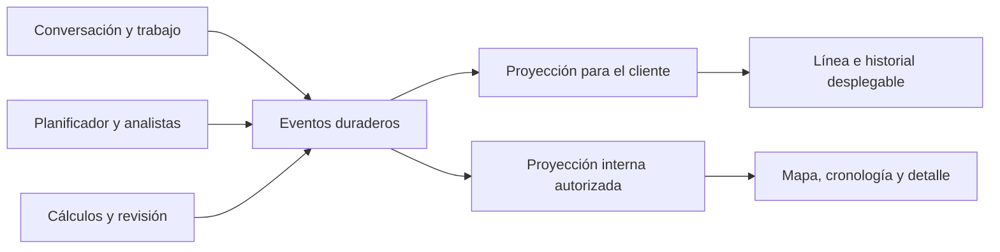

# 3.8 — Actividad para el cliente y monitor interno de investigación

**Estado:** implementado y validado; incrementos 3.8.1–3.8.8 completados.  
**Fecha:** 28 de septiembre de 2026.  
**Base inspeccionada:** `3eaa3ae`, rama `feature/insights-pipeline`.  
**Destino:** diseño ejecutado y guía de continuidad; [contratos finales y uso](live-investigation.md).  
**Enlaces:** [plan general](../product/Decision%20Room%20-%20Plan%20de%20implementacion.md), [onboarding e informes](../product/onboarding-e-informes-plan.md), [3.7](business-planner-plan.md), [resultados de 3.7](../validation/2026-09-28-business-planner.md).

El checkout de referencia al redactar está en `.local/insights-pipeline-worktree` respecto al repositorio principal. Confirmarlo con `git worktree list` y `git status --short --branch`; no editar por accidente otro checkout compartido si la siguiente tarea arranca en la raíz principal.

## 1. Encargo y decisiones ya acordadas

El usuario quiere entender en directo qué está haciendo el sistema. Hay dos experiencias sobre los mismos hechos guardados:

1. **Cliente:** una línea de actividad en la conversación, con una explicación breve de qué se investiga y para qué. Se despliega para consultar actividades anteriores y abrir datos relacionados. Al terminar conserva «Ver proceso».
2. **Nosotros:** monitor interno con agentes, tareas, intercambios explícitos, cálculos, evidencia, revisión, esperas, errores y consumo. Permite seguir una ejecución activa y revisar una anterior.

La línea del cliente combina enfoque actual e historial de tareas terminadas. Ejemplo ilustrativo, que solo debe aparecer si existe esa tarea real: «Estoy comprobando si la caída de la tienda física se concentra en algunos productos». No emitir frases de ejemplo siguiendo un temporizador ni afirmar hallazgos todavía sin revisión.

El usuario prioriza buen producto y calidad sobre ahorro. La observabilidad no debe reducir el presupuesto de investigación. Tampoco debe consumir nuevas llamadas al modelo para narrar cada evento: aprovechar las tareas y decisiones explícitas ya generadas. Este paso no demuestra ni pretende cerrar la mejora de calidad pendiente de 3.7.

**Autorización:** el usuario solicitó implementar este plan. Implementación completada en el checkout asignado; [evidencia y límites](../validation/2026-09-28-live-investigation.md). El cierre funcional no acepta la calidad analítica de 3.7.

## 2. Instrucciones al agente que lo implemente

- Leer `AGENTS.md`, este documento y el cierre de 3.7 antes de editar. Confirmar rama, estado de Git y servidor usado; puede haber otras tareas en otro checkout. Trabajar en el checkout asignado y conservar cambios ajenos.
- Este documento especifica comportamiento y pruebas, no sustituye el diagnóstico del código. Si una firma, archivo o supuesto ha cambiado, localizar el equivalente y adaptar la solución.
- Resolver autónomamente errores, incompatibilidades y regresiones dentro del alcance. Registrar el problema, la decisión y la prueba que lo cubre. No dejar un defecto conocido porque «el plan no lo mencionaba».
- Mantener los requisitos de producto y de autorización del monitor. Consultar al usuario solo ante una decisión de producto realmente nueva o una acción fuera del alcance autorizado.
- Trabajar por incrementos 3.8.1–3.8.8. Actualizar las casillas y el registro de continuidad con hechos y evidencia; realizar commits locales de incrementos coherentes, siguiendo `AGENTS.md`. No hacer push sin petición explícita.
- No declarar un incremento completo con pruebas omitidas sin justificación. Distinguir pruebas guionizadas de protocolo, comprobación visual y ejecución real del modelo.
- No relanzar la matriz de 24 informes de 3.7: sus resultados quedan conservados. Este paso necesita pruebas de observabilidad y una demostración real dirigida.

## 3. Diagnóstico del código actual

Rutas relativas a la raíz del repositorio. Verificar de nuevo al implementar.

| Área | Código inspeccionado | Lo existente y su consecuencia |
|---|---|---|
| Estado del trabajo | `decision_room/web/service.py`: `detail`, `sync`, `update`, `run_job`, `reply`, `retry` | `detail` calcula `activity` a partir del último estado del planificador/revisor. No es un historial. `sync` tiene efectos sobre estado: el monitor no debe usarlo como lector de eventos. |
| Conversación | `decision_room/conversations.py`: `run`, `_job`, `_answer`, `_save`, `detail`, `events` | Guarda turnos, llamadas, recuperaciones y vínculo al trabajo. Un chat breve puede finalizar sin crear un informe. |
| Planificación inicial | `decision_room/agent/graph.py`, `persistence.py`, `service.py` | Inspección, propuesta, preguntas y revisiones persistentes. Es distinta del rol planificador de negocio de 3.7. |
| Planificador de negocio | `decision_room/agent/business_planner.py` | Registra consultas/direcciones/respuestas y pausas. El mensaje explícito del analista está en el contexto de la llamada. |
| Investigación | `research_graph.py`, `research.py`, `research_contract.py`, `research_agenda.py` | Pasos con acciones, agenda, ejecuciones y candidatos. Existen checkpoints y versiones históricas. |
| Subanalistas | `parallel_research.py` | Relaciones padre/hijo, asignaciones y tiempos; importación atómica de resultados al principal. Los pasos importados no son trabajo nuevo. `finished_at` también puede establecerse al fallar: no equivale a éxito. |
| Revisión | `review_graph.py`, `review.py`, `review_context.py` | Eventos por rol y ronda, objeciones, cálculos, borrador, aprobación y posibles bloqueos posteriores. Aprobar no garantiza que siga siendo publicable. |
| Llamadas | `agent/persistence.py`: `_model_call`; `agent/model.py`: `_generate`, `record_transport` | Inicio/fin, caché, contexto, salida, uso y reintentos 429/503. `stream: False`: recibir HTTP por partes no proporciona narración semántica en vivo. |
| Cálculos | `decision_room/execution.py`: `execute`, `get_execution`, `recover_executions` | Código aislado y artefactos conservados; reutilizar su procedencia. No ejecutar código desde el monitor. |
| Base de datos | `database.py`, `schema.sql` | Conexiones `autocommit=True`; transacciones explícitas para grupos. Esquema 24 en la base inspeccionada. Añadir la siguiente migración disponible, no asumir 25 si otra tarea ya la ocupó. |
| API y acceso | `web/server.py`, `web/__main__.py`, `web/errors.py` | Servidor HTTP del espacio local, cookie de acceso común, comprobación de origen y host. No existe rol interno separado. |
| Datos del cliente | `web/preview.py`, `frontend/src/components/workspace/data-preview.tsx` | Vista paginada con pertenencia a negocio/dataset y selección de tabla/columna. Reutilizarla, sin abrir rutas de archivos. |
| Línea actual | `frontend/src/components/workspace/chat.tsx`, `job.tsx`, `entry/guided-onboarding.tsx` | Tres presentaciones de progreso parcialmente duplicadas; `FirstReportProgress` y trabajo/turno hacen polling cada 3 s. |
| Componentes base | `frontend/src/components/ui/collapsible.tsx`, `sheet.tsx`, `tabs.tsx`; `ai-elements/reasoning.tsx` | Reutilizar estética y primitives. `reasoning.tsx` abre/cierra automáticamente y mide tiempo en cliente: esas conductas no sirven sin adaptación para un historial persistente. |
| Datos frontend | `frontend/src/lib/hooks.ts`, `api.ts`, `types.ts`, `App.tsx` | `useResource` aborta al desmontar pero cada instancia crea su polling. Hará falta una suscripción compartida por proceso para evitar duplicados. |

También cubrir la inspección de relaciones en `decision_room/data_knowledge/discovery.py` y `decision_room/data_knowledge/service.py`, productores de `data_model_discoveries` y `data_model_revisions`. No reconstruir relaciones a partir de nombres de archivo.

## 4. Experiencia del cliente

### 4.1 Línea plegada e historial

Crear un componente compartido `AnalysisActivity` (nombre propuesto) para chat, onboarding y detalle del informe. Debe funcionar también para un turno que aún no tiene `job_id`.

- Una línea con indicador de estado, descripción concreta y botón de desplegar. Estado inicial real: «Preparando el análisis» o «En cola», según registro.
- Añadir el propósito cuando exista en el encargo/tarea, por ejemplo «Comparando canales para localizar dónde cambia la actividad». Es un resumen de la tarea, no un acceso a razonamiento privado del modelo.
- Al desplegar: tareas en orden de inicio, con estado actual y acceso a hitos anteriores. Agrupar reintentos técnicos dentro de la misma tarea; conservar cambios de enfoque importantes.
- Una tarea iniciada cambia a completada al obtener su resultado confirmado. Separar «cálculo completado» de «conclusión revisada».
- Al terminar: «Análisis completado · Ver proceso». Si la entrega es parcial, mostrarlo; si está bloqueada, «El análisis necesita atención». Ningún estado fallido se representa con un check verde.
- Una sola superficie de actividad por proceso dentro de una pantalla. En onboarding, la tarjeta inferior puede enlazar al mismo historial, sin duplicar la línea del chat.
- Al volver a un informe o recargar, recuperar historial y estado sin reiniciar duración ni ejecutar trabajo.

### 4.2 Elección de la actividad visible

Prioridad: acción necesaria del cliente → interrupción/fallo recuperable → espera del proveedor confirmada → trabajo activo → tarea en cola → estado final. Una rama fallida con recuperación en curso no convierte automáticamente todo el proceso en fallido; enseñar el estado agregado real.

Si hay varias ramas, usar una frase estable como «Investigando productos y canales · 2 tareas en curso» cuando esas etiquetas sean conocidas. Mostrar cada rama al desplegar. No alternar frenéticamente la línea según el último paquete recibido. Un inicio muy breve puede verse directamente completado en el historial; no retrasar el estado final para animarlo.

Aplicar la prioridad de espera al estado global solo si realmente impide avanzar. Si una rama espera al proveedor y otra sigue calculando, mantener el trabajo activo en la línea y mostrar la espera en la rama correspondiente. Una pregunta bloqueante del proceso sí toma prioridad; una consulta de contexto opcional no debe fingir una pausa que el motor no ha hecho.

No mostrar porcentaje de avance o ETA sin una base medible: el número de investigaciones puede cambiar. Si una llamada tarda, mantener la actividad real y el tiempo transcurrido; no inventar nuevos pasos para aparentar actividad.

### 4.3 Explicaciones y contenido

Usar descripciones procedentes de tareas/encargos aceptados y acciones validadas. La proyección pública selecciona campos permitidos y textos acotados; no enviar `rationale`, `summary`, `instructions` o el contexto completo directamente al navegador del cliente.

Primera implementación: construir la frase con el tipo de actividad y la pregunta/objetivo de la tarea, cuyo ámbito y referencias están comprobados. Un texto como «Investigar: {pregunta}» es un fallback honesto. Usar plantillas solo para estados operativos; las ramas y preguntas las sigue escogiendo el agente según los datos.

Cuando el texto de tarea contenga una conclusión en vez de una intención, usar el fallback neutral del tipo de acción y permitir abrir la tarea sin publicar la conclusión candidata. No intentar garantizar esa distinción mediante una lista de palabras. Si no basta la estructura existente, introducir un campo explícito y acotado de **descripción de actividad pública** en las decisiones pertinentes, con contrato/prompt versionados y compatibilidad de checkpoints; no añadir una llamada de narración ni volver obligatorios campos en registros antiguos. Documentar esa decisión y probar que el campo nunca habilita publicación de resultados.

Los cambios de dirección pueden verse como «Ampliando la comparación por producto» cuando se guarda una expansión real. En esta primera versión los valores y hallazgos candidatos quedan en el monitor interno; el cliente accede a conclusiones cuando cumplen los controles existentes de publicación. No exponer cadenas de pensamiento, tokens de razonamiento ni campos de razonamiento privado del proveedor en ninguna vista. Los intercambios explícitos de tareas, preguntas y decisiones sí forman parte del monitor interno.

### 4.4 Datos, preguntas y navegación

- «Ver datos» solo si hay referencias comprobadas: tabla, columna y versión. Abrir el panel existente, manteniendo conversación y borrador de respuesta.
- La pregunta al cliente usa el flujo actual de `reply`/preguntas; la actividad muestra «Esperando tu respuesta» y enlaza a ella. No crear otra vía de respuesta en el historial.
- Preguntas sobre datos abren las referencias correspondientes usando el comportamiento de vista previa existente. Una pregunta de contexto operativo sin tabla no debe abrir una tabla arbitraria.
- Las respuestas desconocidas/rechazadas y las replanteaciones actualizan la actividad de acuerdo con 3.7. Una definición nueva no deja tareas antiguas como evidencia vigente.
- Evidencia de un informe aprobado usa las rutas existentes. Si se corrigió la versión, se retiró evidencia o un bloqueo independiente impide publicación, respetar ese estado también desde «Ver proceso».
- En un informe terminado conservar un acceso a «Ver proceso». Un análisis antiguo sin eventos muestra «Historial detallado no disponible para este análisis» y los datos históricos verificables que existan.

### 4.5 Accesibilidad y movimiento

Botón con `aria-expanded`, navegación de teclado, estado con texto además de icono, región `aria-live="polite"` para cambios relevantes de la línea. No anunciar de nuevo todo el historial en cada polling. Respetar movimiento reducido y tema claro/oscuro. Mantener posición de lectura si el usuario ha subido; indicar nueva actividad sin forzar scroll. Estado de despliegue persistente durante navegación y polling; no cerrar automáticamente al acabar si el usuario lo tenía abierto. Diseñar a 375 px y escritorio con textos largos.

## 5. Monitor interno

Ruta propuesta `#internal/investigations`, con detalle `#internal/investigations/<trace_id>`. Es una sección interna autenticada, sin entrada en la navegación normal del cliente.

1. **Lista de procesos:** negocio, objetivo, origen, fecha, estado, fase, duración y última actividad. Filtrar por negocio/estado y paginar. Seleccionar negocio aquí no cambia el negocio activo del cliente.
2. **Mapa:** conversacional → planificación/planificador de negocio ↔ analista principal → subanalistas → redacción/revisión. Mostrar únicamente roles realmente participantes; representar por separado instancias de subanalistas. El mapa sale de tareas y relaciones guardadas, no de un dibujo fijo que encienda actores inexistentes.
3. **Cronología:** filtrar por actor, rama, fase y errores; elegir una tarea muestra sus eventos, entradas y resultados. En directo actualizar sin perder selección ni posición. Para un proceso finalizado el historial queda consultable. Una reproducción animada con velocidad configurable es opcional posterior, no requisito de cierre.
4. **Detalle:** encargo recibido, consulta explícita del analista, respuesta del planificador, tablas/versiones, código ejecutado, salida acotada, métricas, referencias, borradores/revisión y motivo de corrección. Abrir cargas grandes bajo demanda, con límites y paginación. Etiquetar «candidato», «borrador», «revisado», «obsoleto» según corresponda.
5. **Recursos:** tiempo de pared, espera del cliente/proveedor, llamadas lógicas e intentos HTTP, programas, tokens conocidos, uso desconocido y aciertos de caché. Agregar por IDs únicos; los resultados importados de un subanalista no vuelven a consumir tokens ni tiempo. No sumar duraciones paralelas como duración total ni mostrar cero cuando el uso es desconocido. Coste monetario solo con tarifa/modelo/fecha disponibles; de lo contrario, «no calculado».
6. **Diagnóstico:** cada evento público apunta a su tarea/evento de origen interno. Permitir localizar qué produjo una frase pública y cuándo se guardó. Los tiempos distinguen inicio/fin real y reconstrucción histórica.

El monitor consulta; las acciones de responder, reintentar o publicar continúan en sus flujos actuales. No incluir terminal, ejecución de código ni modificación de checkpoints en este paso.

## 6. Arquitectura y contrato de persistencia



### 6.1 Identidad y tablas propuestas

Crear un módulo pequeño, por ejemplo `decision_room/observability/`, con contratos, persistencia, instrumentación y proyecciones separadas. Mantener servicios web en `decision_room/web/activity.py` y `internal_monitor.py` o equivalentes. No concentrar todo en `web/service.py`.

Entidades propuestas, adaptar nombres al estilo existente:

| Entidad | Campos mínimos y reglas |
|---|---|
| `activity_traces` | `id`, `business_id`, origen chat/trabajo/investigación, `created_at`, contador `last_sequence`, versión de contrato. Una identidad estable a través de reintentos y sesiones sucesoras. |
| `activity_links` | Pertenencia de turno, trabajo, sesión, investigación, rama y revisión al proceso. Tipos/IDs validados y unicidad. Conservar la cadena de sesiones sustituidas; no perder el pasado porque `web_jobs.research_id` cambie. |
| `activity_tasks` | `id`, `trace_id`, `business_id`, `parent_task_id`, `actor_id`, rol, tipo, clave de origen, estado, intento, referencias, fechas y última secuencia aplicada. Es una proyección reconstruible, no la autoridad del análisis. |
| `activity_events` | `id`, `trace_id`, `business_id`, `sequence`, `task_id`, clave de deduplicación, tipo, versión, `occurred_at`, `recorded_at`, origen y payload acotado. Apéndice inmutable; correcciones mediante eventos nuevos. |

Incluir claves compuestas de pertenencia a negocio/proceso y referencias que no permitan enlazar tareas de otro negocio. Un `parent_task_id` debe pertenecer al mismo proceso y no formar ciclos. Índices `(business_id,trace_id,sequence)`, procesos por fecha/estado y claves de origen únicas. Determinar el borrado/retención usando las convenciones del dossier: no duplicar filas de cliente o grandes contextos dentro de eventos.

El turno crea su proceso antes de la primera llamada; `_job` vincula el trabajo derivado al mismo proceso. Un trabajo iniciado sin chat crea su propio proceso. Los turnos de aclaración que continúan ese trabajo enlazan al proceso existente. Una petición realmente nueva tiene proceso nuevo. Las ramas heredan explícitamente la identidad. Para CLI/evaluaciones, crear un proceso al iniciar la sesión si no hay raíz web, y conservar asociación al conectar después; no duplicar raíces ni inferirlas por nombre de negocio.

Contexto de observación explícito o contexto local al hilo: no usar una variable global mutable. `ThreadPoolExecutor` necesita propagación explícita; un `ContextVar` no cruza automáticamente a los subanalistas. Los IDs/contadores de observación nunca entran en prompts, fingerprints o claves de caché analíticas.

### 6.2 Eventos y estados

Eventos mínimos: proceso creado/vinculado; tarea encolada/iniciada/completada/fallida/interrumpida; consulta enviada/respondida; delegación y resultado recibido; inspección/cálculo iniciado/terminado; candidato registrado; borrador presentado; revisión solicita cambios/aprueba/bloquea; pregunta pendiente/respuesta guardada; replanteación; espera/reintento HTTP; resultado reutilizado; entrega disponible/restringida; pérdida de observabilidad detectada.

Estados de tarea: `queued`, `running`, `waiting_owner`, `waiting_dependency`, `retry_wait`, `completed`, `failed`, `interrupted`, `superseded` (o equivalentes inequívocos). No reutilizar «completed» para una llamada incierta. Actor en espera de hijos se muestra esperando, aunque el trabajo global siga activo.

Guardar eventos después de validar la acción y antes/después del efecto correspondiente. Una llamada HTTP completada no significa contrato válido; registrar la validación/reparación por separado. Las aprobaciones del revisor y la disponibilidad de entrega son hechos distintos. El proceso tiene su propio estado agregado y campos de entrega/publicabilidad: que terminen todas las tareas no implica que haya un informe aprobado.

Ejemplo mínimo de evento interno, con identificadores ilustrativos (el contrato real usará UUID):

```json
{
  "schema_version": 1,
  "trace_id": "trace-A",
  "sequence": 42,
  "task_id": "task-productos",
  "actor_id": "subanalista-2",
  "type": "execution.completed",
  "source": {"kind": "execution", "id": "execution-X"},
  "occurred_at": "2026-09-28T12:00:00Z",
  "recorded_at": "2026-09-28T12:00:00Z",
  "reconstructed": false,
  "payload": {"result_status": "completed"}
}
```

Su proyección pública puede actualizar una tarea a «Comparación por producto completada», con referencias autorizadas. No entrega automáticamente el resultado candidato de ese cálculo. Su detalle interno resuelve `execution-X` en el ámbito del proceso para cargar código y resultados cuando se soliciten.

### 6.3 Atomicidad, orden y reanudación

Esta parte es obligatoria; un historial visualmente convincente con hechos perdidos no cumple el paso.

- Escritura de transición de dominio y evento en la misma transacción corta siempre que compartan conexión. Con `autocommit=True`, dos `execute` consecutivos no son atómicos por defecto.
- Confirmar el evento de inicio **antes** de una llamada lenta o ejecución externa. Nunca mantener un lock de secuencia/transacción durante red, sandbox, espera de cliente o `sleep` de reintento.
- Orden de eventos por proceso: bloquear brevemente la fila raíz y asignar secuencia dentro de la transacción. Un contador/sequence global PostgreSQL por sí solo no garantiza orden de commit: una rama puede reservar 10, otra confirmar 11 y el cliente perder 10 al avanzar cursor. Cubrir ese caso con prueba concurrente.
- Clave idempotente basada en origen real, por ejemplo llamada+intento+tipo, investigación+paso+tipo o revisión+paso+tipo. Repetir una operación guardada no crea un segundo «completado». Una recuperación real añade su intento con su propia identidad.
- No duplicar cálculos al importar pasos de subanalistas: conservar relación `imported_from`/evento de recepción, reutilizando el `execution_id` original.
- Empezar por IDs y metadatos pequeños. Código/contexto/resultados quedan en su almacenamiento autoritativo y se cargan por referencias al abrir el detalle.
- Si falla la escritura de observación, no volver a llamar al modelo ni cambiar un resultado válido por un fallo de telemetría. Usar savepoint para el apéndice opcional, registrar fallo operativo y reconciliar desde registros autoritativos. No dejar la transacción de dominio abortada por ignorar una excepción SQL.
- Reconciliación explícita al arrancar/recuperar el worker y herramienta de mantenimiento; los GET son de lectura. Crear eventos faltantes con clave determinista, `reconstructed=true` y tiempos conocidos. Si no hay inicio fiable, declararlo desconocido.
- Detectar pérdida de detalle: `history_complete=false` y una advertencia operativa. No convertir ausencia de eventos en éxito. Un monitor cerrado no detiene la captura.
- Separar última actividad de salud del worker. Una llamada larga no prueba que el worker murió. Implementar heartbeat/lease ligero del propietario del proceso o reutilizar uno real si aparece; tras perderlo indicar «sin actualización/interrupción por confirmar», nunca relanzar trabajo desde el lector. El worker recuperador confirma qué quedó incierto.
- Datos históricos anteriores a 3.8: snapshot/importación histórica explícita con metadatos disponibles, sin fingir un timeline preciso. No reenviar llamadas para rellenarlo.

## 7. Instrumentación: dónde y qué registrar

| Productor | Punto de integración | Hechos necesarios |
|---|---|---|
| Conversación | `conversations.py`: creación/ejecución de turno, `_answer`, `_job`, `_save` | Cola, consulta de contexto/datos, revisión breve, pregunta y vínculo al trabajo. Saludos/respuestas directas también finalizan sin inventar análisis. |
| Ingesta/modelo de datos | productores reales de importación/descubrimiento ER | Archivos preparados, inspecciones y relaciones comprobadas, con referencias/versiones. «Cuatro archivos revisados» solo con cuatro registros confirmados. |
| Planificación inicial | `agent/graph.py`, `persistence.save_revision` | Inspección, propuesta y preguntas registradas. No confundir propuestas de relación con relaciones verificadas. |
| Llamadas | `_model_call`, persistencia de `chat_calls` y revisión del chat | Inicio, fin, error, uso, caché, rol y relación con tarea. Registrar contratos rechazados después de validarlos. |
| Transporte | `model.record_transport`, `_generate` | Cada intento 429/503 y espera real, con duración/reintento previsto. Añadir observador sin reemplazar el recorder actual de uso ni cambiar la política de recuperación incierta. |
| Planificador de negocio | `business_planner.checkpoint` o función vigente, respuestas | Consulta y dirección guardadas, prioridad de tarea, pregunta, pausa, respuesta y sesión sucesora. Leer la firma real. |
| Principal | `research_graph`: `decide`, `python`, `record`, `delegate`, `business`, `stop` | Actividad elegida, cálculo, candidato, ampliación, bloqueo, síntesis y consulta. Solo acciones validadas. |
| Subanalistas | `parallel_research.reserve`, `dispatch` | Encargo antes de arrancar, inicio por trabajador, estado final real y recepción del principal. Datos visibles mientras los otros trabajadores siguen activos. |
| Sandbox | `execution.execute` y recuperación | Inicio real, éxito/error/timeout, `execution_id`, tablas y artefactos. Un replay con ejecución existente es reutilización, no nuevo cálculo. |
| Revisión | `review_graph`, `review.py` | Redacción, borrador, objeciones, correcciones, revisión final y bloqueos; referencia a versiones del borrador. |
| Trabajo web | `Workspace.run_job/update/reply/retry` | Cola, transición de fase, espera, recuperación y publicabilidad. Enlazar sesiones nuevas antes de que emitan eventos. |

Los eventos de memoria/descripciones auxiliares solo se adjuntan si su causalidad con este proceso está registrada. La extracción de memoria en segundo plano de otro turno no debe aparecer como trabajo del informe. El monitor no inventa un actor adicional por cada función Python.

## 8. API, autorización y actualización en directo

### 8.1 API del cliente propuesta

- `GET /api/jobs/<id>/activity?after=<cursor>&limit=100`.
- `GET /api/chats/<chat_id>/turns/<turn_id>/activity?after=<cursor>&limit=100` (adaptar al router actual).
- Turno y trabajo vinculados devuelven el mismo `trace_id`; resolverlo en servidor con pertenencia al negocio. Un cursor de otro proceso se rechaza.
- `GET /api/.../activity/<task_id>` para detalle público si hace falta; alternativamente incluir solo referencias pequeñas y reutilizar preview/evidencia existentes.

Respuesta tipada: `schema_version`, `trace_id`, `status`, `headline`, `active_tasks`, `task_updates`, `events`, `next_cursor`, `has_more`, `history_complete`, `server_time`, `last_activity_at`, estado de conexión/worker y referencias públicas autorizadas. No trasladar dicts de dominio enteros. Separar eventos históricos y actualización del estado de una tarea para que una tarea vieja pueda terminar sin reaparecer como nueva.

Primera petición devuelve estado actual y última página de historial, con cursor para páginas anteriores; suscripción posterior usa cursor hacia delante. Definir nombres distintos `before`/`after` y pruebas de límites para no mezclar ambos sentidos. El cursor de avance representa la última secuencia **inspeccionada**, aunque el filtro público oculte eventos internos; no saltarse hechos sin procesar. Snapshot y cursor deben corresponder al mismo corte consistente. Si hay más páginas nuevas, drenarlas inmediatamente antes del siguiente intervalo. IDs únicos para deduplicar, orden del servidor y límite máximo acotado (p. ej. 200).

No obtener contexto completo, informes HTML ni ejecutar DuckDB para cada poll. Publicabilidad/versión obsoleta deben consultarse en un resumen autorizado y acotado; el histórico de un check no sustituye su estado actual. Cachear respuestas solo por proceso, audiencia y revisión, nunca globalmente entre negocios.

### 8.2 Transporte elegido para 3.8

Usar **polling incremental cada 2 segundos** mientras haya actividad, compatible con el servidor HTTP actual. Objetivo comprobable: una transición confirmada aparece en la interfaz en menos de 3 segundos en la demostración local con conexión normal. No se requiere WebSocket/SSE para cumplir la experiencia.

Crear `useActivity` y una caché/suscripción compartida por proceso y audiencia. Un chat y su tarjeta de onboarding no abren dos bucles. Cancelar peticiones al cambiar de negocio/ruta; respuestas antiguas no pueden sobrescribir la nueva selección. No solapar fetches. Al ocultar la pestaña reducir/pausar; al volver hacer catch-up inmediato. Ante error de red conservar lo visto y marcar «Reconectando», con backoff acotado; no cambiar el trabajo a fallido.

Al llegar a estado terminal detener el polling rápido, hacer una lectura final coherente y refrescar al recuperar foco/abrir historial o recibir invalidación del estado general. Una corrección posterior de datos puede cambiar la vigencia de un informe ya terminado. Waiting-owner no es terminal: reducir frecuencia sin perder respuestas enviadas desde otra vista. Separar sincronización visual de los POST de respuesta/reintento.

SSE queda como mejora posterior si las medidas justifican cambiar transporte. No añadir ambos mecanismos en este paso.

### 8.3 Acceso interno independiente

El acceso actual del cliente no sirve para distinguir operadores. Implementar activación explícita del monitor en servidor (flag/config, desactivado por defecto) y credencial interna independiente, guardada localmente con permisos restrictivos. No reutilizar la clave del cliente ni publicar la interna en `/api/workspace`, HTML, logs o URL con query.

Este flag controla el acceso al monitor, no la captura de eventos comunes que necesita el cliente. El historial se sigue guardando con el monitor desactivado o cerrado.

Una opción concreta compatible con el servidor actual:

- Ruta frontend interna con pantalla propia de acceso y API `/api/internal/login`, `/api/internal/logout`, `/api/internal/session`.
- Cookie interna distinta, `HttpOnly`, `SameSite=Strict`, path `/api/internal`, y `Secure` al servir con HTTPS. Login/logout conservan controles de origen/host y cabecera de aplicación. La sesión del cliente sola nunca autoriza estas rutas.
- `GET /api/internal/investigations`, `GET /api/internal/investigations/<trace_id>`, `.../events`, `.../tasks/<task_id>`, `.../calls/<call_id>`, `.../executions/<execution_id>` con paginación y validación del ámbito del proceso en **cada** detalle.
- La autorización interna permite inspeccionar los negocios del espacio configurado; no cambia `web_workspace` ni acepta un ID arbitrario de otra instalación/esquema. Monitor desactivado devuelve 404 en todas sus rutas; credencial incorrecta devuelve 401/403 sin datos.
- El frontend interno no debe depender de que la app del cliente haya seleccionado/completado onboarding. Ajustar `App.tsx` para resolver su entrada sin abrir una sesión de cliente implícita.

En `server.py`, resolver las rutas internas con su propia autorización antes de aplicar el guard general de sesión del cliente. Probar un operador sin cookie de cliente y un cliente sin cookie interna; ninguno debe heredar los permisos del otro por el orden de las condiciones del router. No aceptar `internal=true`, cabeceras de rol o un parámetro de URL como autorización.

Excluir por contrato claves de API, cookies, DSN, cabeceras, razonamiento privado y rutas personales del host. Mostrar entradas/salidas estructuradas del agente con referencias y texto del negocio autorizado; paginar/limitar, con señal de truncamiento. No devolver `context_payload` completo por defecto. Revisar tanto el allowlist como cadenas de errores/URLs/código que puedan incorporar secretos; usar canarios en pruebas. El cliente no debe recibir diagnósticos internos aunque el frontend no los pinte.

## 9. Secuencia de implementación y entregables

### [x] 3.8.1 — Contratos, identidad y migración

Crear contratos de eventos/estados/referencias, esquema incremental, escritor idempotente y proyectores iniciales. Definir y probar creación de raíz, vínculos turno→trabajo→sesiones→ramas y secuencia ordenada por commit. Implementar la política de fallo de observación con reconciliación.

**Salida:** migración vacía y desde esquema previo; dos productores concurrentes sin pérdida; rollback sin evento ficticio; reejecución idempotente; aislamiento entre negocios. Documento del contrato final y decisión de secuenciación.

### [x] 3.8.2 — Instrumentación completa del recorrido

Conectar productores de §7, pasando contexto al hilo de cada subanalista. Incorporar inicios duraderos de llamadas/cálculos, intentos, preguntas, revisión y publicación. Añadir heartbeat/reconciliación. No cambiar selección de ramas, modelos, límites o política de revisión para conseguir una animación mejor.

**Salida:** recorrido guionizado con dos ramas, consulta al planificador, pregunta, respuesta, revisión y entrega; ver eventos intermedios desde otra conexión antes de acabar. Verificar que abrir/cerrar observadores no altera número de llamadas, ejecuciones ni resultado. Una llamada de varias decenas de segundos sigue visible durante su espera.

### [x] 3.8.3 — Proyección pública y API incremental

Implementar resumen de enfoque, estado agregado, cursor/páginas, detalle público y datos relacionados. Dar formato a tareas y agrupar operaciones técnicas. Añadir tests de campos exactos permitidos y de ausencia de contenido interno en toda la respuesta.

**Salida:** job/turno resuelven la misma historia; reconexión y paginación recuperan eventos sin pérdidas/duplicados; replan conserva cadena y obsolescencia; GET no inicia llamadas, cálculos, reintentos ni escrituras de eventos.

### [x] 3.8.4 — Componente del cliente e integración

Crear `frontend/src/components/workspace/analysis-activity.tsx` y hook compartido (nombres adaptables). Integrar chat, `JobPage`, `FirstReportProgress` y acceso desde informe terminado. Reutilizar Collapsible/Sheet y el estilo existente. Adaptar acceso a datos al contexto de tarea sin simular una pregunta al usuario.

**Salida:** línea estable, propósito, historial persistente, paralelismo agrupado, pregunta en el chat con datos, final/parcial/fallo coherentes. Pruebas de teclado, 375 px, escritorio, modo oscuro, reconexión y no duplicar polling ni spinners.

### [x] 3.8.5 — API interna y control de acceso

Implementar flag de activación, clave/cookie independiente, rutas tipadas y acceso por proceso a llamadas/cálculos/eventos. Desacoplar la ruta interna del onboarding del cliente. Añadir pruebas negativas antes de conectar la UI.

**Salida:** sesión cliente no accede al monitor; desactivado no responde datos; detalles de otro proceso/negocio se rechazan; secretos canario ausentes; lectura interna no altera selección ni ejecución.

### [x] 3.8.6 — Monitor interno

Construir lista y filtros, mapa con actores/tareas reales, timeline y panel de detalle. Usar CSS/SVG y componentes existentes para el mapa; no incorporar un editor de grafos si no hace falta. Timeline accesible como alternativa al mapa. Datos grandes bajo demanda; consultas ligeras durante seguimiento.

**Salida:** seguir dos ramas en paralelo, abrir consulta planificador↔analista, localizar un cálculo y su evidencia, revisar objeción/corrección, ver tokens conocidos e incertidumbres. Un clic desde evento público interno localiza el evento de origen. Refrescar mantiene filtro, selección e historial.

### [x] 3.8.7 — Recuperación, rendimiento y demostración real

Ejecutar matriz de §10 con PostgreSQL y sandbox reales donde corresponda. Realizar un informe nuevo de Bruma en negocio/dataset de prueba aislados. Seguir simultáneamente cliente e interno y conservar mediciones/evidencia de la ejecución. La pregunta del planificador puede no ocurrir naturalmente: cubrirla con escenario determinista, y declarar cuál fue real.

**Salida:** evidencia visual del cliente plegado/desplegado, datos de pregunta, dos agentes activos, consulta y revisión; registro de IDs/eventos y latencia medida. Si el informe falla o queda bloqueado, conservarlo y comprobar que ambas vistas lo dicen correctamente. No repetir hasta obtener una captura favorable ni afirmar mejora de calidad del informe por este paso.

### [x] 3.8.8 — Revisión y cierre

Revisar diff, controles de acceso, tamaño de respuestas, compatibilidad de sesiones anteriores y efectos sobre el recorrido del cliente. Crear `docs/validation/<fecha>-live-investigation.md` con comandos, resultados, capturas locales y límites. Actualizar este documento y ambos planes de producto sin alterar los resultados históricos de 3.7. Revisar staged para secretos/rutas/datasets privados; commit local y comunicar hash y comprobaciones.

**Salida:** requisitos obligatorios de §11 cumplidos y documentación para arrancar/abrir cada vista. No publicar claves de acceso en Git ni cerrar aceptación de calidad analítica.

## 10. Pruebas concretas

### 10.1 Backend y consistencia (obligatorias)

Crear suites focalizadas como `tests/test_activity.py` y `tests/test_internal_monitor.py`. Usar patrones existentes de `test_web`, `test_business_planner`, `test_parallel_research` y esquemas temporales; no migrar ni borrar el negocio que el usuario está probando.

| Caso | Verificación necesaria |
|---|---|
| Secuencia concurrente | Retrasar commit de rama A mientras B emite; ningún cursor hace perder el evento de A. No mantener transacciones durante red. |
| Caché/replay | Reanudar con resultado guardado no duplica tareas completadas ni cuenta dos veces llamadas/programas. |
| Crash después de efecto | Interrumpir entre resultado de dominio y emisión/reconciliación; recuperar sin repetir cálculo/modelo y marcar reconstrucción. |
| Escritor averiado | Inyectar fallo de evento, comprobar savepoint/estado de dominio válido y señal de historial incompleto. |
| Proceso sin observador | Generar y terminar con navegador cerrado; después obtener historial completo. |
| Ramas paralelas | Ver B activa mientras A finaliza; fallo de C no pinta completado por tener `finished_at`. Importación al padre no duplica resultado. |
| Preguntas | Contexto continúa con mismos cálculos; definición/alcance crea sucesor; desconocido/rechazo conserva límite y no repite entrevista. |
| Revisión | Submit→revise→corrección→approve→entrega disponible; aprobación interna seguida de hold no da «informe listo». |
| Transporte | 429/503 muestran espera e intento real con reloj simulado; timeout incierto se mantiene incierto; ninguna lectura autoriza reintento. |
| Proveedor lento/worker | Evento inicial visible desde otra conexión durante llamada bloqueada; heartbeat distingue espera viva de proceso sin actualización. |
| Historial/páginas | Más de 200 eventos, filtros internos, cursor ajeno/inválido, snapshot coherente, página nueva y antiguas sin huecos ni duplicados. |
| Acceso | Cliente, operador, monitor desactivado, negocio ajeno, llamada/tabla/evidencia ajenas, informe borrado/datos corregidos, login con origen inválido. |
| Proyección pública | Canarios en prompts, rationales, salidas rechazadas, cabeceras, errores, rutas y tokens nunca aparecen en JSON público. UI interna aplica su propio contrato acotado. |
| No efectos del GET | Verificar ausencia de llamadas, nuevas ejecuciones, cambios de estado analítico y cambio de negocio activo al leer. |
| Compatibilidad | Registros anteriores sin eventos/fechas, checkpoints research-v4/v5/v6 admitidos, sesiones nuevas del esquema actual y migración repetible. |

### 10.2 Frontend (obligatorias)

Pruebas de componente/integración: desplegar/cerrar con teclado, propósito correcto, varias ramas, cambios del mismo task ID, estado esperando/pregunta, datos relacionados, terminal/parcial/obsoleto, recarga, error/reconexión, cambio rápido de negocio con fetch anterior pendiente, teardown de timers, pestaña oculta, final sin polling rápido y refresco al volver, una suscripción compartida en onboarding. Monitor: filtros, selección estable, detalle autorizado, credenciales ausentes de almacenamiento cliente/logs, uso desconocido, paneles acotados y mapa coherente con timeline.

### 10.3 Comandos orientativos

Confirmar entorno y documentación de tests antes de ejecutar. Las suites existentes usan `unittest`, algunas importan módulos hermanos de `tests`; incluir `PYTHONPATH=tests`. PostgreSQL y Docker deben estar disponibles para integración. No contar tests saltados por falta de entorno como pruebas superadas.

```sh
PYTHONPATH=tests .venv/bin/python -m unittest discover -s tests -p 'test_activity*.py'
PYTHONPATH=tests .venv/bin/python -m unittest discover -s tests -p 'test_internal_monitor*.py'
PYTHONPATH=tests .venv/bin/python -m unittest test_web test_conversations test_onboarding_conversation test_business_planner test_parallel_research test_model_retry
npm --prefix frontend test
npm --prefix frontend run build
npm --prefix frontend run lint
git diff --check
```

Añadir regresión de ejecución/revisión/memoria si se tocan esas zonas. Tras pasar comprobaciones pertinentes, ampliar solo para resolver un riesgo concreto; no repetir toda la evaluación de calidad. Dejar comandos realmente ejecutados y sus resultados en validación.

### 10.4 Rendimiento y evidencia de funcionamiento real

- Medir latencia `recorded_at`→visible usando reloj/registro local, con pantalla activa y conexión normal; objetivo <3 s para el polling de 2 s. Pruebas de temporización de frontend usan reloj falso; la demostración real mide por separado.
- Preparar historial sintético de al menos 1.000 eventos y tres productores concurrentes para verificar paginación y consultas indexadas. Respuesta pública máxima de página como objetivo ≤100 KB; no incluir contextos/código. Si un caso supera el objetivo, reducir payload sin ocultar estado ni perder referencias y documentar medición.
- El estado plegado no debe descargar cada artefacto ni disparar consultas por cada evento. Comprobar número de peticiones y ausencia de bucles simultáneos por montaje duplicado.
- Comparar mismo recorrido guionizado con observación activa/inactiva: idénticos efectos analíticos; el overhead puede medirse por separado. El coste de observación no se evalúa con otra generación estocástica como si fuera idéntica.
- Una ejecución real de Bruma basta para comprobar transporte y correspondencia eventos/UI si recorre las piezas pertinentes; completar estados faltantes con fixtures deterministas identificadas. No forzar preguntas/revisiones innecesarias al modelo para completar una captura.

## 11. Criterios para darlo por terminado

- [x] El cliente ve enfoque actual real e historial plegable sin recibir mensajes internos.
- [x] Chat, onboarding e informe comparten proceso y componente; no hay spinners o suscripciones duplicadas.
- [x] Datos y preguntas conservan referencias, versión y continuidad de conversación.
- [x] El monitor muestra actores/ramas reales, intercambios explícitos, cálculos, revisión y uso conocido.
- [x] Acceso interno independiente comprobado por servidor; cliente no puede consultar detalles internos.
- [x] Pausas, errores, reintentos, caché, paralelismo, sucesores y obsolescencia se representan correctamente.
- [x] Eventos duraderos y ordenados; paginación/reconexión no pierden trabajo; GET no ejecuta acciones.
- [x] El observador no cambia decisiones, llamadas ni cálculos; fallos de telemetría quedan señalados y recuperables.
- [x] Pruebas relevantes pasan, demostración visual y ejecución real registradas, límites explícitos.
- [x] Migración/compatibilidad verificadas; documentación y commits locales revisados; sin datos privados en Git.

Fuera del cierre obligatorio: replay animado, exportación pública de trazas, mando para pausar/cancelar agentes, ejecución manual de código desde monitor, proveedor externo de trazas, predicciones, brainstorming y otra ronda de mejoras analíticas. Si durante implementación se detecta un defecto real del recorrido que impide cumplir lo anterior, corregirlo y registrar su prueba.

## 12. Registro de continuidad para compactación

**Continuidad vigente:** 3.8 implementado y validado. Base de implementación `2063fc5`, rama `feature/insights-pipeline`. Esquema 25, PostgreSQL y sandbox reales. No se migró ni reinició la vista original de 8791. Demostración aislada en 8792: job `44717add-6254-409f-af3c-7e103deebf9c`, trace `bf5bb200-1851-55a4-8df3-04258980d36f`, Bruma ficticio, una creación y reanudación del mismo job. Resultado aprobado; 22 llamadas, tres cálculos, tres subanalistas, cuatro consultas al planificador. La aceptación analítica de 3.7 sigue abierta.

El cliente y el monitor están implementados sobre eventos compartidos y proyecciones distintas. Polling incremental de 2 s; monitor desactivado por defecto, clave/cookie independiente, GET sin efectos. Worker sampler y mantenimiento explícito; reconstrucción identificada. Detalle estructurado bajo demanda y acotado. Tokens desconocidos se declaran; no se calcula precio monetario. Ver [uso y contrato final](live-investigation.md) y [validación completa](../validation/2026-09-28-live-investigation.md).

| Incremento | Estado final | Evidencia/commit |
|---|---|---|
| Plan documental | Completado | `2063fc5` |
| 3.8.1 Contratos/persistencia | Completado | `551902a`; migración, orden por commit, savepoint, aislamiento. Pruebas ampliadas en `4eb62ac`. |
| 3.8.2 Instrumentación | Completado | `4eb62ac`; llamadas lentas visibles, ramas, preguntas, revisión, transporte y reconstrucción. |
| 3.8.3 API pública | Completado | `4eb62ac`; snapshots/cursor, whitelist, continuidad y GET sin efectos. |
| 3.8.4 Cliente | Completado | `274b5ac`; historial compartido, datos, chat/onboarding/informes y móvil. |
| 3.8.5 Acceso/API interna | Completado | `4eb62ac`, `bc0cdc6`; flag, cookie/clave independientes, detalles acotados y evento exacto autorizado. |
| 3.8.6 Monitor | Completado | `274b5ac`, `bc0cdc6`; actores reales, filtros, evento exacto, intercambios, cálculos y recursos. |
| 3.8.7 Validación integrada | Completado | 21 pruebas específicas más 7 del monitor final, regresiones de 122 y 54, 92 UI, build/lint, Bruma real y latencia visible de 1,54 s. Los conjuntos se solapan. |
| 3.8.8 Cierre | Completado | Documentación de uso/validación, planes actualizados, revisión de staged y commits locales. Sin push. |

Correcciones finales: pregunta inicial fechada desde revisión, metadata de intentos preservada, duración fijada al fin del dominio, actor del redactor unificado, numeración solo de subanalistas, caché interna borrada al caducar autorización, ScrollArea sin ensanchar móvil e historial único para turnos del mismo proceso. El detalle localiza el evento seleccionado incluso fuera del historial reciente. Pruebas y demostración guardadas; archivos privados permanecen en `.local/evaluation/live-38/` e ignorados por Git.

No quedan defectos conocidos bloqueantes del alcance 3.8. La siguiente decisión de producto sigue siendo la calidad y utilidad analítica; no usar este cierre como evidencia de mejora de insights. No modificar ni mezclar las generaciones históricas de 3.7.

### [x] 3.8.9 — Correcciones posteriores a la auditoría

La auditoría posterior encontró defectos que matizan el cierre original de 3.8:
memoria inicial aplicada tarde, proceso vacío del chat, tiempos de chat sin fin
real y detalle interno poco legible. El seguimiento está en
[validación de las correcciones](../validation/2026-09-28-live-investigation-fixes.md).
Incluye barrera de memoria, invalidación observable y recuperación conservando
historia, hitos públicos y etiquetas breves del agente, tiempos reales de chat,
detalle estructurado y recuperación de vistas antiguas. Estado: validado con pruebas automatizadas, revisión visual y Bruma recuperado
con informe aprobado, contexto vigente e historial completo (esquema 26). No tomar el cierre original como evidencia de ausencia de estos
fallos; conservar la auditoría y los resultados del seguimiento.

### 3.8.10 · Gráficos compartidos y continuidad de la respuesta

Alcance acordado: dimensiones explícitas elegidas por el agente y verificadas contra
los puntos guardados; barras horizontales agrupadas, leyenda estable y cambios
separados de cantidades. Compatibilidad conservadora para informes anteriores sin
alterar cifras ni aprobación. Aplicar a presentación web y exportación HTML.

Actividad pública: hitos semánticos compactos; conservar llamadas y revisiones en
el monitor. Presentar gradualmente solo texto aprobado de respuestas nuevas,
coordinando el estado de actividad; historial inmediato, movimiento reducido y
opción de mostrar todo. Corregir metadatos de fechas de informes y evitar adjuntar
un informe completo a respuestas administrativas.

Validación prevista: contratos, procedencia, ausencias y orden; actividad agrupada;
texto nuevo/histórico, navegación y accesibilidad; pruebas de regresión, compilación
y comprobación visual con el informe guardado de Bruma Café y un chat real.

**Cerrado:** 3.8.10 implementado y validado. Véase
[gráficos y continuidad del chat](../validation/2026-09-28-charts-and-chat-flow.md).
No cambia el alcance pendiente de otras entregas del producto.
