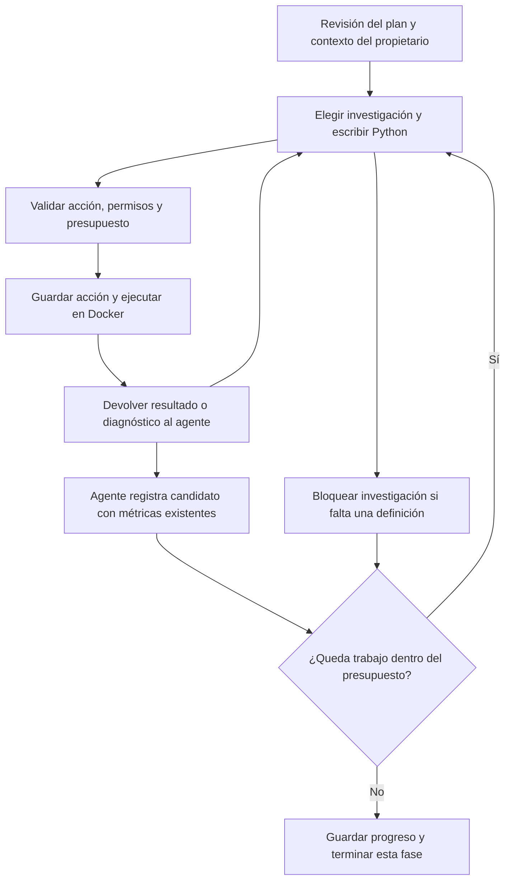

# Investigación con Python: paso 1.5

El agente principal puede elegir investigaciones de un plan guardado, escribir
Python, ejecutarlo en el sandbox, examinar la salida y corregir errores. Registra
resultados **candidatos**, con código y evidencia. El revisor y el informe del
paso 1.6 todavía no están implementados.

El fallo de interpretación de `amount` se conserva como
[DR-001](../validation/known-agent-errors.md). Se avanza para evaluar el conjunto;
añadir Python no demuestra que las definiciones del agente sean correctas.

## Flujo



El mismo modelo y la misma identidad de sesión de planificación se usan para la
fase de investigación; no es otro agente. Un grafo separado, con un checkpoint
`research:<UUID>`, permite conservar distintos intentos de investigación sobre una
misma revisión del plan sin sobrescribir la planificación.

Antes de aceptar `finish`, el controlador exige registrar o bloquear cada
investigación ya ejecutada. Alcanzar un límite del controlador puede dejarla
pendiente, siempre visible como tal.

Cada ejecución conserva el programa exacto, huellas de las entradas y del entorno,
definiciones empleadas, métricas, evidencia, logs y artefactos. El modelo recibe el
último intento por investigación con logs acotados; el historial completo permanece
en PostgreSQL y archivos privados. El texto de razonamiento interno no se guarda.

## Archivos

| Archivo | Función |
|---|---|
| `decision_room/agent/research.py` | Crear, consultar y reanudar investigaciones; vincularlas al conocimiento vigente y detectar obsolescencia. |
| `decision_room/agent/research_graph.py` | Nodos de decisión, Python, registro de candidatos y parada; idempotencia de cada acción. |
| `decision_room/agent/research_contract.py` | Acciones permitidas, referencias a tablas, dependencias y límites de intentos. |
| `decision_room/agent/research_context.py` | Recuperar observaciones del ejecutor y preparar un contexto acotado para el modelo. |
| `decision_room/agent/research_prompts.py` | Instrucciones versionadas y contrato de `dr_runtime` para generar código. |
| `decision_room/agent/model.py` | Admite el contrato de investigación y corrección acotada de respuestas JSON inválidas. |
| `decision_room/agent/persistence.py` | Llamadas separadas por fase e investigación, con presupuestos y caché de recuperación. |
| `decision_room/agent/service.py` | Replantear con contexto corregido, conservar el vínculo y sustituir resultados anteriores. |
| `decision_room/schema.sql` | Migración 4: investigaciones, pasos, candidatos, versiones de contexto y fases de llamadas. |
| `decision_room/execution_contract.py` | Diagnóstico que enumera métricas sin evidencia para que el agente pueda corregirlas. |
| `decision_room/__main__.py` | Comandos de investigación y replanteamiento. |
| `tests/test_research.py` | PostgreSQL y Docker reales; modelo simulado explícitamente para verificar el controlador. |
| `scripts/checks/check_research.py` | Pruebas con el modelo real y exportación del recorrido, programas y artefactos. |

## Preparación y uso

No se añaden bibliotecas al sandbox. Se reutilizan Docker/Colima, DuckDB, pandas,
NumPy, SciPy, matplotlib, seaborn, statsmodels, scikit-learn, PyArrow y openpyxl ya
instalados. Los paquetes del agente siguen en `.venv`. Ejecutar desde la raíz:

```sh
.venv/bin/python -m decision_room init
.venv/bin/python scripts/dev/local_sandbox.py status
```

Con un plan creado mediante `agent-start`:

```sh
.venv/bin/python -m decision_room agent-research \
  --business UUID_EMPRESA --session UUID_SESION \
  --request-key investigacion-1 --max-investigations 2

.venv/bin/python -m decision_room research-show \
  --business UUID_EMPRESA --research UUID_INVESTIGACION

.venv/bin/python -m decision_room research-resume \
  --business UUID_EMPRESA --research UUID_INVESTIGACION
```

El agente elige entre investigaciones listas. Se puede acotar con uno o varios
`--investigation CLAVE_DEL_PLAN`. Una investigación con dependencias sin resolver
no puede ejecutarse. Si el plan está esperando una respuesta, se permite investigar
la parte independiente que ya figure lista.

Estados de la fase:

- `completed`: todas las investigaciones seleccionadas tienen candidatos;
  **no significa aprobación analítica**.
- `partial`: hay trabajo sin empezar, bloqueado o limitado por el presupuesto.
- `failed`: hubo un fallo que impidió continuar; las acciones previas se conservan.
- `stale`: una nueva definición, respuesta o revisión ha sustituido el conocimiento
  usado para calcular; esos resultados no son candidatos vigentes.

Toda salida incluye `publishable=false` y `verification=pending_reviewer` o `stale`.
El agente solo puede asociar un candidato a métricas existentes de la última
ejecución correcta de esa investigación. La descripción del agente sigue siendo
una afirmación que deberá examinar el revisor.

## Cambiar una definición

Crear un archivo con el contexto completo corregido, incluyendo las aclaraciones
anteriores que sigan siendo válidas. El comando crea otra sesión vinculada:

```sh
.venv/bin/python -m decision_room agent-replan \
  --business UUID_EMPRESA --session UUID_SESION_ANTERIOR \
  --context-file contexto-corregido.md --request-key correccion-1
```

Los resultados de investigación anteriores pasan a `stale` inmediatamente, incluso
si la nueva planificación falla. Se conservan para auditoría. Después se ejecuta
`agent-research` con la nueva sesión. El código se vuelve a generar usando la
definición nueva. No se cambia silenciosamente un resultado existente.

Responder a una pregunta del paso 1.4 también invalida conservadoramente las
investigaciones hechas con la revisión anterior. Todavía no existe invalidación
selectiva por dependencias: puede hacer falta recalcular trabajo independiente.

Si el agente descubre durante Python una nueva ambigüedad, puede marcar esa
investigación como bloqueada y explicar qué aclaración necesita. Este paso no añade
otra conversación de preguntas dentro del grafo de investigación: se aporta la
aclaración mediante `agent-replan`. La pausa y respuesta inicial del paso 1.4 se
mantiene disponible.

## Aislamiento, recuperación y límites

- El modelo proporciona código y IDs de tablas autorizadas. La aplicación fija los
  alias, rutas, imagen, credenciales ausentes y límites. Nunca usa `exec()` en el
  anfitrión para ejecutar el programa del modelo.
- Docker mantiene entradas de solo lectura, ausencia de red, usuario sin privilegios,
  1 CPU, 768 MiB, límites de procesos, archivos y tiempo del sandbox existente.
- Por ejecución: 30 segundos por defecto; el operador puede seleccionar 1–120 con
  `--timeout`. Por investigación, como máximo tres intentos Python. Entre una y tres
  investigaciones por recorrido, dos por defecto; 12 decisiones y 16 llamadas al
  modelo, contando correcciones. Alcanzar un límite no implica análisis completo.
- Cada acción se guarda antes del efecto. Una caída después de terminar Python y
  antes del checkpoint reutiliza el mismo `execution_id` mediante su clave de
  idempotencia; no vuelve a ejecutar el programa completado.
- Un contenedor abandonado en estado `preparing` o `running` requiere
  `recover-executions --business UUID` antes de `research-resume`. No se asume que
  un proceso de Python incompleto haya terminado bien.
- Una respuesta HTTP incierta conserva esa condición. `research-resume --retry-model`
  permite repetirla explícitamente, con el mismo riesgo de coste descrito en la
  guía del agente. Una acción inválida admite una corrección; no hay bucles ilimitados.
- Una salida JSON envuelta en un único bloque Markdown puede desempaquetarse. No se
  repara ni modifica el código generado. Un JSON malformado se guarda como diagnóstico
  y se devuelve al modelo para corrección, sin ejecutar nada.
- Las observaciones omiten resultados mayores de 24 KB y recortan logs a 4.000
  caracteres por campo. El modelo debe generar una salida más enfocada antes de
  registrar ese candidato. Los artefactos completos siguen disponibles.
- Sigue vigente el límite de contexto de 200 KB. No hay compactación automática ni
  recuperación general de artefactos extensos por parte del modelo. Se implementarán
  antes de ampliar a investigaciones largas; los límites actuales no se ocultan.

El programa puede devolver una cifra incorrecta y una explicación plausible.
Validar JSON y comprobar que existe evidencia no demuestra que el código o las
definiciones sean correctos. DR-001 y la revisión semántica continúan pendientes.

## Pruebas y recorrido visible

```sh
.venv/bin/python -m unittest discover -s tests -v
.venv/bin/python scripts/checks/check_research.py --model qwen3.8-27b-splash
.venv/bin/python scripts/checks/check_research.py --model qwen3.8-27b-splash \
  --case 03-ambiguous-amount --basis unit_price
```

El script guarda un `trace.md` legible, `research.json`, los programas exactos y
los artefactos en `.local/research-checks/<ID>/`, excluido de Git. Permite abrir el
recorrido sin volver a ejecutar el modelo:

```sh
.venv/bin/python scripts/checks/check_research.py \
  --business UUID_EMPRESA --research UUID_INVESTIGACION
```

También admite una sesión existente (`--business ... --session ...`), variantes de
columnas y `--replace-session` para comparar definiciones. Las referencias de
evaluación se leen después de terminar las llamadas al modelo y no forman parte
de su contexto. Los resultados reales se registran en el
[informe de validación](../validation/2026-09-21-research-check.md).
