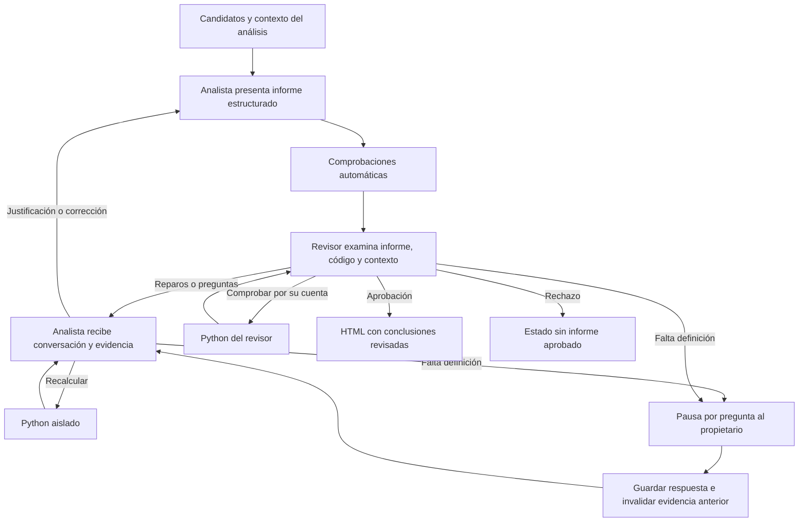

# Revisor, conversación e informe: paso 1.6

La revisión toma candidatos del paso 1.5 y abre una conversación entre el mismo
analista y un rol revisor. El analista prepara el informe, responde a objeciones,
justifica, recalcula o retira conclusiones. **Solo el revisor puede aprobar la
versión exacta del informe.** Una defensa del analista nunca equivale a aprobación.

## Recorrido



El revisor puede aceptar una justificación fundada, pedir otra corrección o rechazar
el informe. No modifica el contenido del informe por su cuenta: devuelve cambios
al analista. Si hace una comprobación Python propia, debe solicitar un borrador
actualizado antes de aprobarlo para que el analista incorpore esa evidencia.

Se tolera que el modelo omita campos vacíos no aplicables: se completan con `null`,
`""` o `[]`. Nunca se infiere una acción ni se transforma una devolución en una
ejecución. Mezclar código con una acción distinta de `execute` sigue rechazándose.

Un presupuesto agotado, una respuesta inválida o un desacuerdo no se convierten en
aprobación por defecto. Se conservan el motivo y el recorrido.

## Contexto y persistencia

La revisión tiene su propio checkpoint `review:<UUID>` y comparte la sesión del
analista. Cada llamada reconstruye:

- Contexto original del propietario, respuestas reales y revisiones del plan.
- Plan investigado, candidatos de entrada y perfiles de tablas autorizadas.
- Código, resultados, evidencia y errores de los cálculos originales y de revisión.
- Todos los mensajes de la conversación de revisión, con rol y orden.
- Borrador vigente, comprobaciones automáticas y presupuesto restante.

Esto conserva el contexto disponible; no depende de una conversación oculta en el
servidor del modelo. No se guarda razonamiento interno. El contexto tiene límite de
200 KB; los logs se acotan y una salida mayor de 24 KB se omite explícitamente del
prompt y no se permite citarla como evidencia visible. No se eliminan reparos para
hacer hueco: superar el límite detiene la ejecución. No hay compactación automática.

PostgreSQL guarda `agent_reviews`, `agent_review_events` y `agent_review_answers`
(migración 5), más `agent_review_holds` (migración 6). Las llamadas distinguen `analyst_review` y `reviewer`. Se conserva la
configuración de cada modelo; por defecto ambos usan el modelo de la sesión, con
instrucciones y llamadas separadas. Esto no garantiza errores independientes.

Cada decisión se guarda antes del checkpoint y cada Python usa una clave de
idempotencia. Una caída después de guardar una decisión no vuelve a llamar al
modelo; una caída después de Python no repite una ejecución completada. Las
respuestas HTTP de resultado incierto siguen requiriendo `--retry-model` explícito.

## Preguntas y cambios de conocimiento

Una pregunta al analista es un mensaje `revise`, con `question` opcional: puede contestarla con evidencia
y volver a presentar el informe sin consultar al usuario. Una pregunta al
propietario es `ask_owner`: crea una pausa LangGraph y espera una respuesta real.

La respuesta se guarda antes de reanudar, se añade al conocimiento de la sesión y
queda visible para ambos roles. Se invalidan las investigaciones anteriores y las
revisiones hermanas. La revisión activa sigue adelante con el nuevo conocimiento;
conserva los resultados viejos como obsoletos, exige recalcular antes de citarlos
y vuelve a pasar por el revisor. La invalidación es conservadora para este MVP.

`unknown` y `declined` no confirman ninguna interpretación. Se debe retirar el
trabajo dependiente o presentar solo hallazgos que sigan teniendo soporte, con
limitaciones explícitas. Una respuesta ya guardada es inmutable; para corregirla
se usa `agent-replan` con el contexto completo corregido, como en el paso 1.5.

## Qué comprueba el programa

- Roles y acciones permitidas: el analista no puede autoaprobarse.
- Referencias a ejecuciones autorizadas y métricas existentes, con evidencia.
- Vigencia del conocimiento y huellas de integridad del código y archivos usados.
- Relaciones numéricas declaradas: igualdad, suma, variación porcentual, valor
  cero y valor no negativo, con
  aritmética `Decimal` y tolerancia explícita inferior a una unidad.
- Presupuesto y preguntas duplicadas literalmente.
- Aprobación ligada mediante huella al texto exacto, evidencia y conocimiento;
  cambiar la versión de las reglas deja la revisión anterior obsoleta.

Las relaciones numéricas son opcionales según el análisis. Comparar una métrica consigo misma se rechaza: no demuestra su corrección.
El programa no deduce
por sí solo todas las comprobaciones necesarias ni confirma que una unión sea
correcta. El revisor puede solicitar esas comprobaciones o ejecutarlas en Python.
Un control de referencias válido no demuestra que una frase sea verdadera. La
interpretación semántica y la calidad del código del LLM siguen siendo evaluables.

## Comandos

```sh
.venv/bin/python -m decision_room init
.venv/bin/python -m decision_room review-start \
  --business UUID_EMPRESA --research UUID_INVESTIGACION --request-key revision-1

.venv/bin/python -m decision_room review-show \
  --business UUID_EMPRESA --review UUID_REVISION

.venv/bin/python -m decision_room review-answer \
  --business UUID_EMPRESA --review UUID_REVISION --step NUMERO_PREGUNTA \
  --text 'El importe es el precio unitario neto.' --request-key respuesta-1

.venv/bin/python -m decision_room review-resume \
  --business UUID_EMPRESA --review UUID_REVISION

.venv/bin/python -m decision_room report-export \
  --business UUID_EMPRESA --review UUID_REVISION
```

`review-start --reviewer-model ID` permite otro modelo usando el proveedor
configurado en el entorno; el analista conserva la configuración de su sesión.
No se conecta automáticamente a un proveedor remoto. Las preguntas se responden
con `--disposition unknown` o `declined` si no se conoce o no se aporta la respuesta.

Límites por defecto: 4 rondas de revisión (configurable entre 1 y 6), 20 acciones,
16 llamadas por rol incluidas correcciones, 3 ejecuciones Python por rol y 3
preguntas al propietario. Cada Python tiene 30 segundos y el aislamiento del
paso 1.3. Los límites acumulados no se reinician al reanudar.

Estados: `waiting`, `approved`, `rejected`, `withdrawn`, `limited`, `failed`, `stale`, `held`,
además de `new` y `running`. Solo una aprobación vigente con controles correctos
produce `publishable=true`, con la etiqueta `reviewed_by_agent`. Esta es aprobación
del flujo automático, no garantía de verdad ni publicación externa.

## Bloqueo tras una comprobación independiente

La aprobación del revisor puede ser incorrecta. Si una comprobación posterior
encuentra un fallo, el operador puede bloquear el informe:

```sh
.venv/bin/python -m decision_room review-hold \
  --business UUID_EMPRESA --review UUID_REVISION \
  --reason 'La cifra no coincide con el cálculo independiente.'
```

`review-show` devuelve `held`, `publishable=false`, el motivo y la decisión
histórica del modelo por separado. El diálogo no se reescribe. El modelo no puede
levantar el bloqueo; corregir el trabajo requiere una revisión nueva. Las copias
HTML ya exportadas siguen siendo instantáneas: hay que volver a exportar. Esto se
usó en la prueba real DR-002; no se presenta ese resultado como un acierto del revisor.

## HTML

La aplicación genera HTML; el LLM proporciona solo datos estructurados. El informe
incluye resumen, afirmaciones, límites, métricas, código y operaciones que respaldan
las cifras. Las comprobaciones y la conversación se pueden desplegar. Los informes
sin aprobar muestran ese estado; su borrador queda separado para inspección.

Todo texto se escapa; no se ejecuta HTML del modelo ni JavaScript, no se descargan
recursos externos y se aplica CSP. Las exportaciones y su JSON de auditoría quedan
en el almacenamiento privado, fuera de Git. El HTML es una instantánea con fecha:
un archivo ya exportado no se actualiza ni se revoca a distancia. Para conocer la
vigencia actual se consulta `review-show` o se vuelve a exportar.

No hay servidor público, autenticación de clientes ni dashboard. La CLI sigue
exigiendo el ámbito de empresa; sus UUID no sustituyen la autenticación futura.

## Archivos

| Archivo | Función |
|---|---|
| `decision_room/agent/review.py` | Iniciar, consultar, responder y recuperar; detectar conocimiento obsoleto. |
| `decision_room/agent/review_graph.py` | Alternancia de roles, Python, pausa del propietario, límites y aprobación. |
| `decision_room/agent/review_context.py` | Reconstruir contexto y conversación; recuperar y verificar evidencia. |
| `decision_room/agent/review_contract.py` | Contratos del informe y acciones; referencias y controles numéricos. |
| `decision_room/agent/review_prompts.py` | Instrucciones distintas para analista y revisor. |
| `decision_room/report.py` | HTML privado escapado y JSON de auditoría. |
| `decision_room/agent/model.py` | Transporte del modelo para ambos roles. |
| `decision_room/agent/persistence.py` | Llamadas por rol y respuestas compartidas con la sesión. |
| `decision_room/schema.sql` | Persistencia de revisiones, conversación y respuestas. |
| `decision_room/__main__.py` | Comandos `review-*` y `report-export`. |
| `tests/test_review.py` | Controlador con modelos simulados; PostgreSQL y Docker reales. |
| `scripts/checks/check_review.py` | Ejecución y exportación con modelos reales sobre investigaciones existentes. |
| `scripts/checks/check_review_ambiguity.py` | Inyección explícita de DR-001 para evaluar al revisor real. |

Ver [plan de este paso](review-plan.md), [validación](../validation/2026-09-21-review-check.md)
y [errores conocidos](../validation/known-agent-errors.md).


## Informe del cliente y registro interno

La exportación separa `report.html` (cliente), `internal.html` (desarrollo) y
`review.json` (auditoría). El contrato incluye gráficos y explicaciones de negocio
revisados antes de la entrega. Ver [contenido, archivos y límites](client-report.md).
